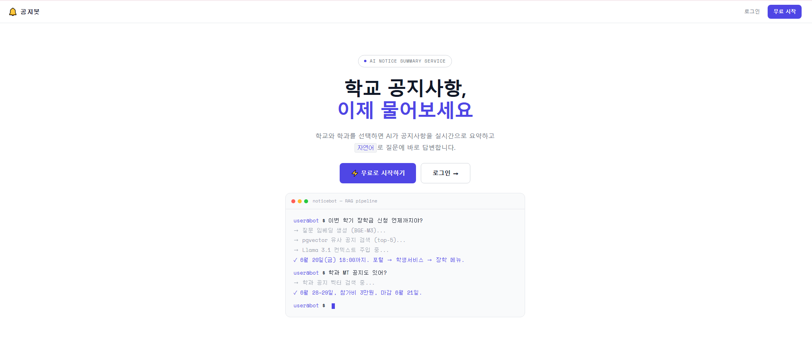
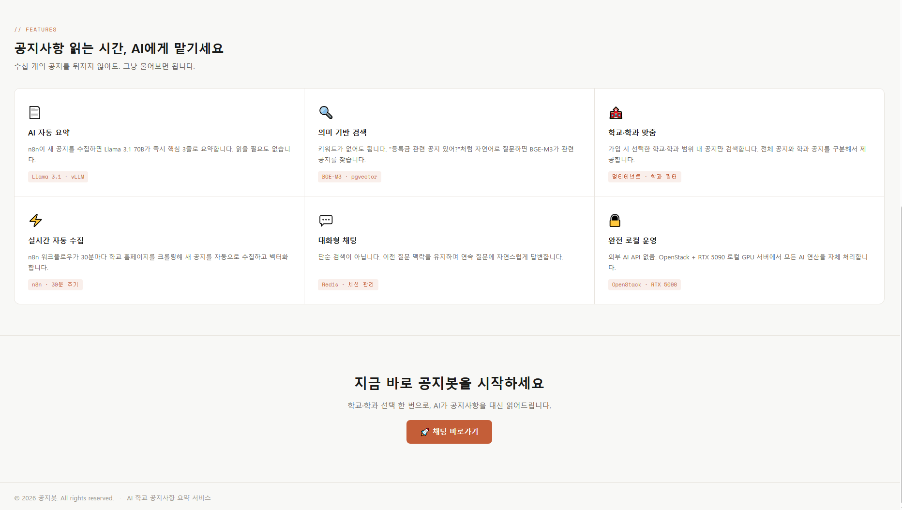
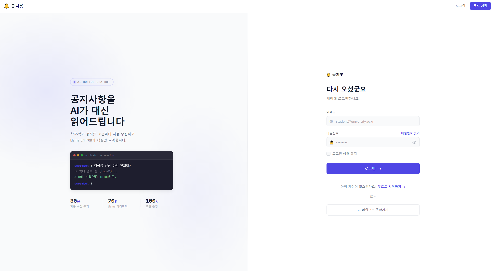
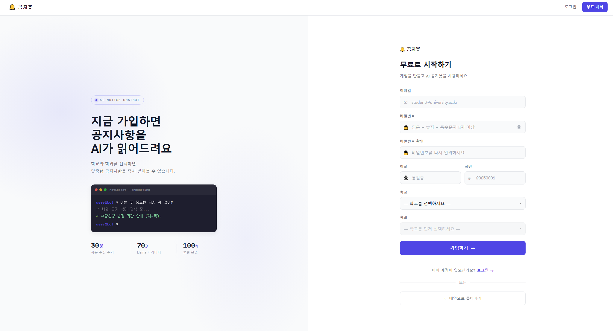
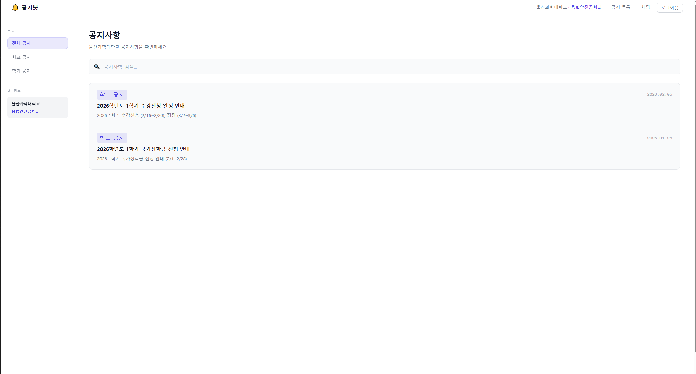
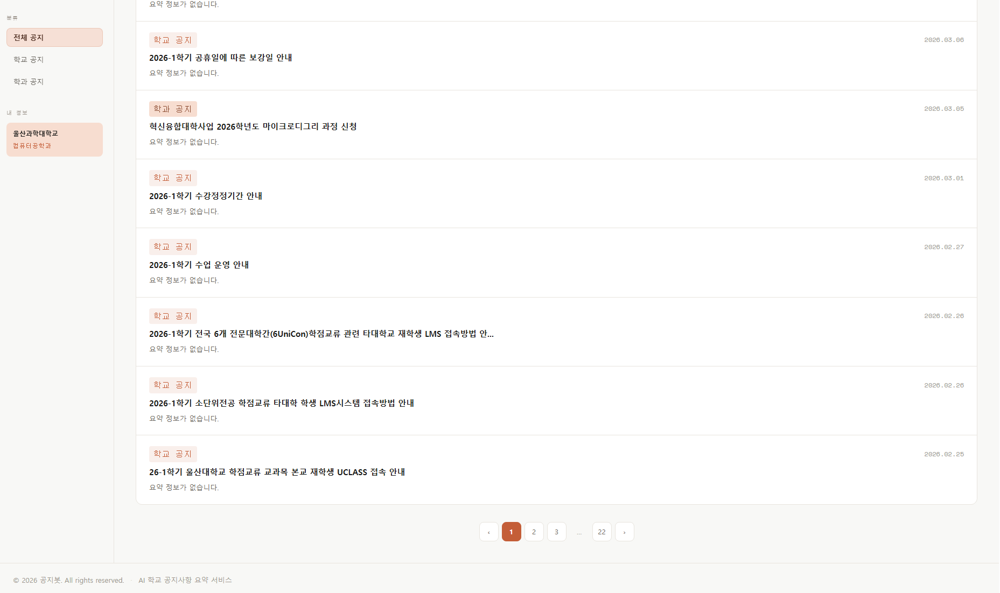
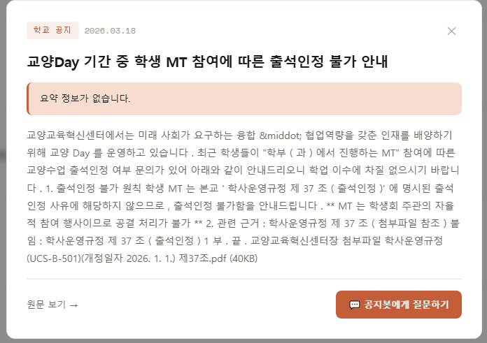
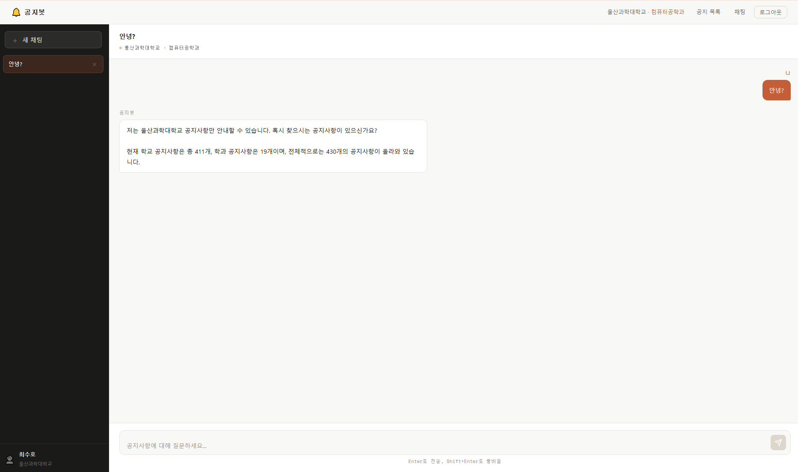
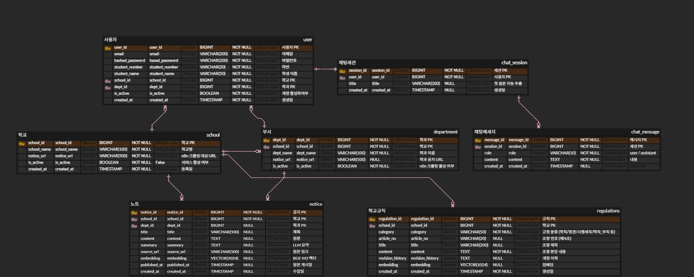

# 공지봇 — AI 대학교 공지사항 챗봇

## 📁 프로젝트 개요

- n8n 워크플로우가 학교·학과 공지사항을 자동 크롤링하고, BGE-M3 임베딩 + pgvector 유사도 검색으로 관련 공지·교칙을 찾아 LLM이 자연어로 답변하는 RAG 기반 AI 챗봇 서비스입니다.
- 가입 시 선택한 학교·학과 범위 내 공지만 검색 대상으로 삼아 개인화된 답변을 제공하며, 타학과 공지는 DB 레벨에서 차단합니다.
- 질문 의도·유형을 자동 분류하고(개수/최신/목록/검색, 공지성/규정성), 학칙·정관 등 교칙까지 검색 대상에 포함하여 단순 RAG의 한계를 보완한 팀 프로젝트입니다.
- 대화 맥락을 기억하고 길어지면 자동 요약(compact)하여, 세션 길이에 관계없이 일관된 답변을 제공합니다.
- 프로젝트 기간 : 2026.04.28 ~ 2026.06.19

## 🤝 팀 소개

<table border="1px solid">
  <thead>
    <tr><td colspan="3" align="center">LLM 챗봇 Project</td></tr>
  </thead>
  <tr align="center">
    <td>이이언 (최수호)</td>
    <td>박영수</td>
    <td>유경민</td>
  </tr>
  <tr>
    <td>
      <a href="https://github.com/Hasegos">
        
      </a>
    </td>
    <td>
      <a href="https://github.com/xuxtaku7610-del">
        
      </a>
    </td>
    <td>
      <a href="https://github.com/ykm-63">
        
      </a>
    </td>
  </tr>
</table>

## 🛠️ 기술 스택

+ **Backend** : 

+ **Frontend** :   

+ **Database** : 

+ **AI / LLM** :    

+ **자동화 / 크롤링** : 

+ **Infra** :  

+ **Tooling** :   

## 🗏 페이지 구성

### 홈 페이지




<br>

+ 학교·학과 셀렉트박스로 가입 진입
+ RAG 파이프라인 터미널 데모 시각화
+ 의미 기반 검색 / 학교·학과 맞춤 / 대화형 채팅 기능 소개

### 로그인 / 회원가입 페이지




<br>

+ 이메일·비밀번호 기반 회원가입 / 로그인
+ 가입 시 학교·학과 선택 → 개인화된 공지 범위 설정
+ 비밀번호: 영문 + 숫자 + 특수문자 8자 이상 검증
+ 로그인 시 JWT HttpOnly 쿠키 발급 (XSS 방어)

### 공지사항 페이지





<br>

+ 학교 공지 + 내 학과 공지 통합 조회 (타학과 공지 차단)
+ 사이드바 필터: 전체 / 학교 공지 / 학과 공지 분류
+ 공지 카드 클릭 시 본문 상세 모달 표시
+ 키워드 검색 (300ms 디바운스)
+ 페이지네이션 윈도잉 처리 (`‹ 1 … 20 21 [22] 23 24 … 43 ›`)

### AI 챗봇 페이지



<br>

+ 자연어 질문 → RAG 기반 공지/교칙 검색 → LLM 답변 생성
+ 질문 의도 자동 분류:
  + 개수 질문 → DB 직접 집계 후 응답
  + 최신/목록 질문 → 최신순 DB 조회 후 응답
  + 일반 질문 → pgvector 코사인 유사도 검색
+ 질문 유형 자동 판단 (공지성 / 규정성 / 혼합):
  + 공지성 질문 → 학교·학과 공지 검색
  + 규정성 질문 → 학칙·정관·시행세칙(교칙) 검색
+ 유사도 + 키워드 보조 검색 병합 (추상적 질문 대응)
+ 교칙 현행/부칙(경과조치) 구분 답변 + 개정 이력 안내
+ 후속 질문 대명사 해소 (직전 대화 맥락으로 검색 보강)
+ 대화 맥락 기억 + compact 자동 요약 (긴 세션도 토큰 한계 없이 유지)
+ RAG 검색 범위: 내 학교·학과 공지 + 학교 교칙
+ 공지 현황(학교/학과/전체 개수)을 매 요청마다 컨텍스트 주입
+ 채팅 세션 관리 (생성·조회·삭제)
+ 마크다운 강조 문법 후처리 제거
+ 무관한 질문 자동 회피 처리

## 📊 ERD (Entity Relationship Diagram)

### 🗺️ ERD 개요



| 테이블 | 설명 |
|---|---|
| `schools` | 학교 정보 + n8n 크롤링 URL |
| `departments` | 학과 정보 + 학과 공지 URL |
| `users` | 사용자 계정 (school_id · dept_id FK) |
| `notices` | 크롤링된 공지 + LLM 요약 + 임베딩 벡터 (vector 1024) |
| `regulations` | 학교 교칙(학칙·정관·시행세칙) + 부칙 분리 + 개정 이력 + 임베딩 벡터 (vector 1024) |
| `chat_sessions` | 채팅 세션 + 대화 요약(compact) |
| `chat_messages` | 채팅 메시지 (role: user/assistant) |

### 📚 프로젝트 문서 / 회고

- 기획, 요구사항 정의, ERD 상세, 화면 설계, 회고(트러블슈팅 포함)는 아래 노션에 정리했습니다.
    - Notion: [학교 공지사항 LLM 챗봇 프로젝트 문서](https://www.notion.so/LLM-360be056f649807ea2b9e99b21dc8b75)

## 📌 API 명세표

### 페이지 라우터
 
| 기능 구분 | HTTP 메서드 | URL | 설명 | 접근 권한 |
|---|---|---|---|---|
| 🏠 홈 페이지 | GET | / | 홈 화면 (학교·학과 셀렉트) | 🔓 모두 가능 |
| 🔑 로그인 페이지 | GET | /login | 로그인 폼 페이지 | 🔓 모두 가능 |
| 📝 회원가입 페이지 | GET | /register | 회원가입 폼 페이지 | 🔓 모두 가능 |
| 💬 채팅 페이지 | GET | /chat | AI 챗봇 채팅 화면 | 🔐 로그인 필요 |
| 📢 공지사항 페이지 | GET | /notices | 공지사항 목록 화면 | 🔐 로그인 필요 |
 
### API 엔드포인트
 
| 기능 구분 | HTTP 메서드 | URL | 설명 | 접근 권한 |
|---|---|---|---|---|
| 📝 회원가입 처리 | POST | /api/auth/register | 신규 사용자 등록 | 🔓 모두 가능 |
| 🔑 로그인 처리 | POST | /api/auth/login | 로그인 → JWT 쿠키 발급 | 🔓 모두 가능 |
| 🚪 로그아웃 처리 | POST | /api/auth/logout | 쿠키 삭제 → 홈 리다이렉트 | 🔐 로그인 필요 |
| 👤 내 정보 조회 | GET | /api/auth/me | 로그인된 사용자 정보 반환 | 🔐 로그인 필요 |
| 🏫 학교 목록 조회 | GET | /api/schools | 활성화된 학교 목록 반환 | 🔓 모두 가능 |
| 🏢 학과 목록 조회 | GET | /api/schools/{school_id}/departments | 학교별 학과 목록 반환 | 🔓 모두 가능 |
| 📋 공지 목록 조회 | GET | /api/notices | 학교 공지 + 내 학과 공지 목록 | 🔐 로그인 필요 |
| 📄 공지 상세 조회 | GET | /api/notices/{notice_id} | 공지 상세 본문 (타학교 403 차단) | 🔐 로그인 필요 |
| 💬 채팅 메시지 전송 | POST | /api/chat | 질문 전송 → 의도·유형 분류 → RAG(공지/교칙) → compact → LLM 응답 | 🔐 로그인 필요 |
| 📂 세션 목록 조회 | GET | /api/chat/sessions | 내 채팅 세션 목록 | 🔐 로그인 필요 |
| 📂 세션 상세 조회 | GET | /api/chat/sessions/{session_id} | 세션 메시지 목록 포함 상세 | 🔐 로그인 필요 |
| 🗑️ 세션 삭제 | DELETE | /api/chat/sessions/{session_id} | 세션 + 메시지 삭제 (소유권 검증) | 🔐 로그인 필요 |

### 💬 채팅 파이프라인 (`POST /api/chat`)

질문 한 건이 처리되는 순서:

1. 의도 분류 (개수 / 최신 / 목록 / 검색)
2. 질문 유형 판단 (공지성 / 규정성 / 혼합)
3. RAG 검색 — 공지(유사도+키워드) + 교칙(현행/부칙 구분)
4. compact — 토큰 70% 초과 시 오래된 대화 자동 요약
5. 시스템 프롬프트 조립 (요약본 + RAG 컨텍스트)
6. Ollama 호출 → 마크다운 후처리 → 응답·저장

## 🔐 보안 설계

| 항목 | 구현 |
|---|---|
| 비밀번호 | bcrypt 해싱 |
| 인증 | JWT HttpOnly 쿠키 (XSS 방어) |
| CSRF | SameSite=Lax |
| SQL 인젝션 | SQLAlchemy ORM + 바인딩 파라미터 + 이름 필드 패턴 차단 |
| XSS | innerHTML 전면 제거 → DOM API만 사용 |
| 공지 접근 제어 | school_id 비교 (타학교 공지 403 차단) |
| 세션 소유권 | user_id 비교 검증 (403 반환) |
| RAG 범위 제한 | 내 학교·학과 공지 + 학교 교칙만 검색 대상 |
| 동시성 | DB 커넥션 풀 + LLM 호출 중 커넥션 미점유 (세션 분리) |
| 500 에러 | 스택트레이스 숨김, 일반 메시지만 반환 |

## 📁 디렉토리 구조

```
openstack-ai-notice-chatbot/
├── 🚀 main.py                        # FastAPI 앱 진입점
│
├── ⚙️ core/
│   ├── config.py                     # Settings (DB · JWT · Ollama · SYSTEM_PROMPT · 풀 · compact 설정)
│   ├── security.py                   # bcrypt + JWT 생성/검증
│   ├── auth.py                       # 쿠키 기반 optional/required 인증
│   ├── exception.py                  # 전역 예외 처리
│   └── templates.py                  # Jinja2 설정
│
├── 🗄️ db/
│   ├── base_class.py
│   ├── base.py                       # 모든 모델 import 집결
│   └── session.py                    # 커넥션 풀 설정 포함
│
├── 🧩 models/
│   ├── school_model.py
│   ├── department_model.py
│   ├── user_model.py
│   ├── notice_model.py               # embedding (vector 1024) 포함
│   ├── chat_session_model.py         # summary · summarized_until (compact) 포함
│   ├── chat_message_model.py
│   └── regulation_model.py           # 교칙 embedding (vector 1024) 포함
│
├── 📨 schemas/
│   ├── user_schema.py
│   ├── school_schema.py
│   ├── notice_schema.py
│   └── chat_schema.py
│
├── 🗂️ crud/
│   ├── user_crud.py
│   ├── school_crud.py
│   ├── notice_crud.py                # 공지 RAG · 키워드 검색 · 집계 · 최신
│   ├── chat_crud.py                  # 세션 CRUD · 요약 저장/조회 (compact)
│   └── regulation_crud.py            # 교칙 유사도 · 키워드 검색
│
├── 🧠 services/                       # 비즈니스 로직 (리팩토링 분리)
│   ├── query_parser.py               # 의도 분류 · 질문 유형 · 키워드/연도/조항 추출
│   ├── llm_service.py                # 임베딩 · Ollama 호출 · 요약 · 마크다운 제거
│   ├── rag_service.py                # 공지/교칙 RAG 컨텍스트 빌드
│   └── memory_service.py             # 대화 compact (토큰 추정 · 요약 트리거)
│
├── 🧭 api/
│   ├── routers.py                    # /api/auth · /api/schools · /api/notices · /api/chat
│   ├── pages.py                      # 페이지 라우터
│   └── endpoints/
│       ├── user_endpoint.py          # 회원가입 · 로그인 · 로그아웃 · 내 정보
│       ├── school_endpoint.py        # 학교 목록 · 학과 목록
│       ├── notice_endpoint.py        # 공지 목록 · 공지 상세
│       └── chat_endpoint.py          # 채팅 · 세션 CRUD · RAG · compact 조립
│
├── 📄 templates/
│   ├── partials/
│   │   ├── head_meta.html
│   │   ├── header.html
│   │   └── footer.html
│   ├── 🏠 home.html
│   ├── 🔐 login.html
│   ├── 📝 register.html
│   ├── 💬 chat.html
│   ├── 📢 notices.html
│   └── ⚠️ error.html
│
├── 🌐 static/
│   ├── 🎨 css/
│   │   ├── common.css                # 색상 변수(:root) · 공통 스타일
│   │   ├── home.css
│   │   ├── login.css
│   │   ├── register.css
│   │   ├── chat.css
│   │   ├── notices.css
│   │   └── error.css
│   └── ⚙️ js/
│       ├── apiClient.js
│       ├── home.js
│       ├── login.js
│       ├── register.js
│       ├── chat.js
│       └── notices.js
│
├── 🐳 Dockerfile
├── 🐳 docker-compose.yml
├── 🌐 nginx/nginx.conf
├── 📜 insert_regulations.py          # 교칙 HWP 파싱 → 임베딩 → DB 적재 (1회 실행 스크립트)
└── 🔑 .env
```